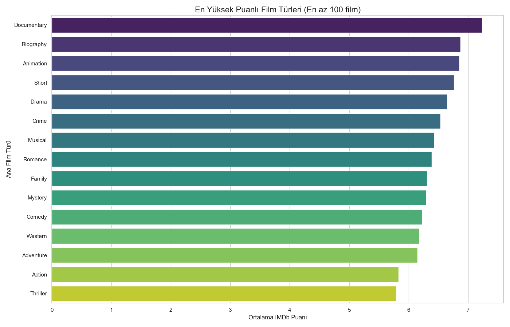
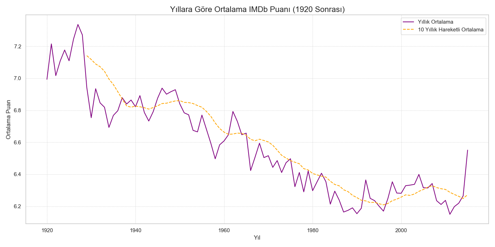
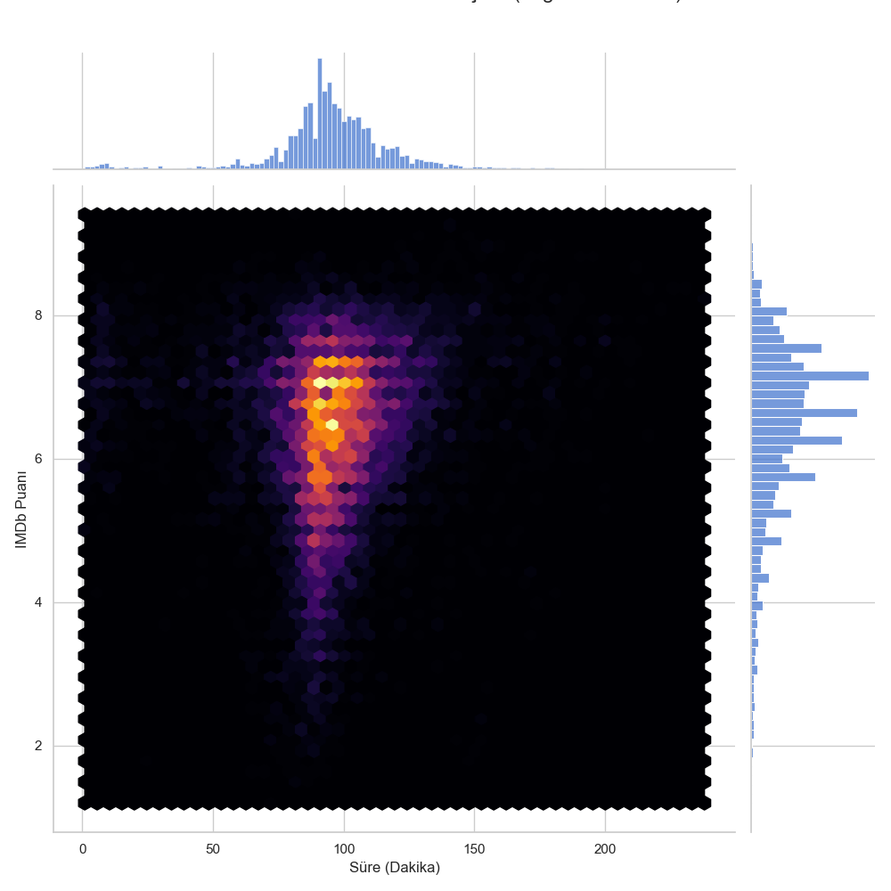

# 🎬 Proje: IMDb Film Veri Analizi ve Otomatik Raporlama

Bu proje, geniş bir IMDb film veri setini analiz ederek film başarısını etkileyen faktörleri (tür, süre, yönetmen) araştırır ve bulguları yönetime sunulabilecek bir formatta (grafikler ve .txt raporu) otomatik olarak üretir.

## 🎯 Amaç

Analiz sonucunda paydaşlara aşağıdaki konularda içgörüler sunulmuştur:
* Hangi film türleri ticari ve eleştirel başarıya daha yatkındır?
* Genel başarı trendleri yıllara göre nasıl değişmektedir?
* Filmin süresi ile puanı arasında (varsa) nasıl bir ilişki vardır?
* Mevcut veri setindeki **kritik kalite sorunları** nelerdir ve hangi analizler **yapılamaz**?

## 🛠️ Kullanılan Teknolojiler

* **Python 3**
* **Pandas:** Veri manipülasyonu ve analizi
* **Numpy:** Sayısal hesaplamalar
* **Matplotlib & Seaborn:** Veri görselleştirme

## 📈 Analizden Çıkan Sonuçlar

1.  **En Başarılı Türler**
    Analiz, (istatistiksel anlamlılık için en az 100 filme sahip olan türler arasında) **'Documentary' (Belgesel)**, **'Biography' (Biyografi)** ve **'Animation' (Animasyon)** türlerinin, diğer türlere kıyasla ortalama IMDb puanı bazında açık ara daha başarılı olduğunu belirlemiştir.

2.  **Yıllara Göre Puan Trendi**
    10 yıllık hareketli ortalamaya bakıldığında, 1970'lerden 2010'lara kadar olan dönemde filmlerin ortalama puanlarında genel bir düşüş trendi gözlenmektedir.

3.  **Süre-Puan İlişkisi (Zayıf Korelasyon)**
    Analiz, film süresi (`runtime`) ile film puanı (`imdbRating`) arasında istatistiksel olarak **çok zayıf pozitif** bir ilişki (Korelasyon ≈ 0.11) bulmuştur. Bu, filmin uzun olmasının puanının yüksek olacağını garanti etmediğini gösterir.

4.  **❗ Kritik Veri Kalitesi Bulgusu**
    Analizin en önemli çıktılarından biri, mevcut veri setindeki kalite sorunlarıdır:
    * **Veri Kaybı:** 46.000+ ham film kaydından, analiz için gerekli tüm temel bilgilere (puan, süre, tür, yönetmen) sahip olan **sadece ~42.000 (%91)** kayıt bulunduğu tespit edilmiştir. Kritik bilgisi eksik olan ~4.000 kayıt analiz dışı bırakılmıştır.
    * **Veri Basitleştirme:** 'Genre' (tür) sütunundaki çoklu veriler (örn: "Comedy, Drama, Sci-Fi") analiz için sadece ana türe ("Comedy") indirgenmiştir. Bu durum, hibrit türlerin analizini engellemektedir.

5.  **Cevaplanamayan Sorular**
    * **Finansal Analiz:** Mevcut veri setinde filmlerin 'Hasılat' (Box Office) veya 'Bütçe' bilgisi bulunmadığı için, "Hangi filmler finansal olarak daha başarılı?" veya "Hangi türün yatırım getirisi (ROI) daha yüksek?" gibi sorular bu veri seti ile **cevaplanamamıştır**.

---

## 📊 Görsel Bulgular (Seçki)

Script'in ürettiği bazı kilit grafikler:

#### 1. En Yüksek Puanlı Türler
(Belgesel, Biyografi ve Animasyon'un baskınlığı net olarak görülmektedir.)


#### 2. Yıllara Göre Puan Trendleri
(Turuncu çizgi, 10 yıllık hareketli ortalamayı göstererek genel trendi vurgulamaktadır.)


#### 3. Süre-Puan İlişkisi
(Yoğunluk haritası, filmlerin çoğunun 90-120 dakika bandında ve 6.0-7.5 puan aralığında kümelendiğini göstermektedir.)


---

## 📝 Nihai Analiz Raporu

Temizleme adımlarının özetinin (örn: kaç verinin neden silindiği) ve tüm sayısal bulguların yer aldığı detaylı metin raporuna `analiz_Raporu.txt` dosyasından ulaşabilirsiniz.

## 🚀 Projeyi Çalıştırma

1.  Bu depoyu klonlayın veya indirin.
2.  Gerekli kütüphaneleri yükleyin:
    ```bash
    pip install pandas numpy matplotlib seaborn
    ```
3.  Veri setini [bu Kaggle linkinden](https://www.kaggle.com/datasets/samruddhim/imdb-movies-analysis) indirin (`movies_initial.csv`).
4.  `film_analizi.py` (veya script'inizin adı neyse) dosyasını çalıştırın:
    ```bash
    python film_analizi.py
    ```
5.  Script sizden `.csv` dosyasının tam yolunu istediğinde, indirdiğiniz dosyanın yolunu belirtin.

Kod çalıştığında, tüm bulguları (`analiz_raporu.txt` ve `.png` grafikleri) içeren `analiz` adında bir klasör oluşturacaktır.
